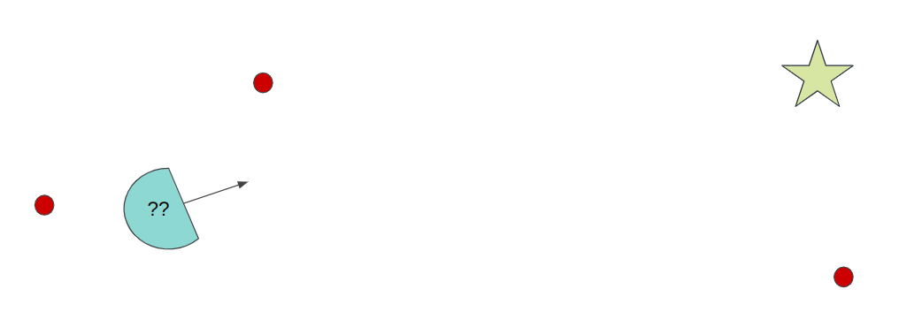
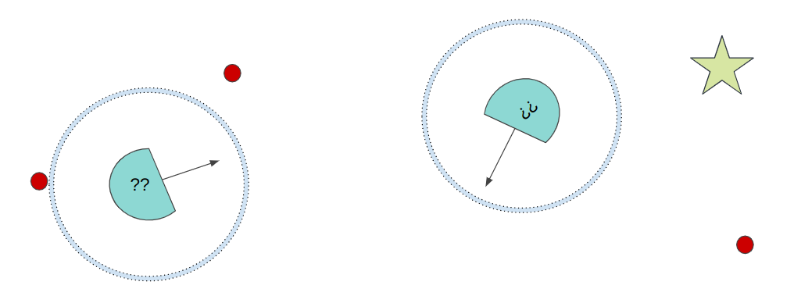
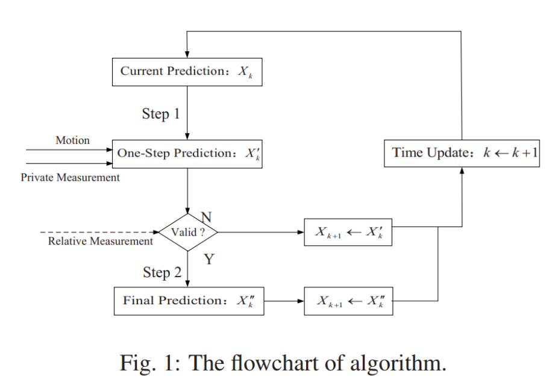

# Probabilistic Robotics Playground: 2D Mobile Robot Simulation Environment

> **Developed by Mik Miller and Swasti Jain**
>
> **Contributors: Victoria Preston and Ivy Mahncke**

## Repository Overview and Vision

This repository builds off of a skeleton mobile robot simulation environment
from the _Probabilistic Robotics_ course at Olin College of Engineering. This
particular branch is associated with the Deep Dive 1 assignment, which explores
the implementation of a decentralized 2-robot multi-agent system attempting to
localize based on noisy sensor observation about the environement and the other
robot.

## Problem Statement

### The typical localization problem:

1 robot trying to localize in environment by observing landmarks (red dots), GPS
measurements and wheel encoder measurements



### The decentralized MAS localization problem:

Decentralized multi-agent system = communication based on observation E.g. 2
robots that have the same mission but cannot communicate with exteroceptive
sensors (camera, radar) until in range



Something to note in our implementation is that the landmark pinger has been
essentially converted into a robot pinger so our implementation we are not using
the landmarks for additional localization information in this case. Future
iterations of this project would compare the efficacy of the localization with
and without extra sensor information such as the landmarks.

## Solving the decentralized MAS Localization Problem with iterated EKF:

In Fei Lu et. al's paper, https://ieeexplore.ieee.org/document/9550407, the
iterated EKF filter is presented as below: 

The whole process can be divided into two parts: Firstly, each agents update its
localization based on motion model and private measurement.

Secondly, if the agent receives the realtive measurement, it will calculate its
localization information again on the basis of step 1.

And if no relative measurement information is received, the agent will use the
results obtained in the first step as the estimation of its localization at
current moment.

_L. Lu, J. Hu, Q. Pan, C. Zhao, Z. Xu and C. Jia, "Decentralized Localization for
Multi-agent Systems Based on Asynchronous Communication," 2021 40th Chinese
Control Conference (CCC), Shanghai, China, 2021, pp. 5489-5494, doi:
10.23919/CCC52363.2021.9550407. keywords: {Location awareness;Asynchronous
communication;Estimation;Collaboration;Frequency estimation;Topology;Kalman
filters;Collaborative Localization;Kalman Filter;Multi-agent System},_

## File Structure

```bash
├── src/
    ├── ideation/
├── input/
├── output/
├── markdown_tutorials/
├── test/
├── README.md
├── notes.md
├── requirements.txt
```

`src` houses the source code for this project.

`ideation` houses the newer iterations and multi-agent augmentations to the base
simulation. Files kept separate for debugging purposes

`input` houses example input files that configure the simulator.

`output` houses output files generated by the simulator.

`markdown_tutorials` houses tutorials for how to run the simulator and implement
the functions.

`tests` houses the unit tests for verification.

## File Overview

This is a brief overview of each of the files.

### Utils.py

- Function for wrapping angles

- Position class: returns xy robot cordinates --> x --> y
- Pose class: returns Position with heading --> pos: Position --> theta
- Bounds class: checks if an xy corrdinate is within bounds --> x_min --> x_max
  --> y_min --> y_max --> within_x (x) --> within_y (y) --> within_bounds (pos)
- Landmark class: identifiable naviagation aid --> pos --> id
- Bearing Range class: landmark and robot relationship --> landmark_id -->
  bearing --> range

### Environment.py

- Initalize instances for starting variables

- Input to Output Functions

  --> Update robot position and heading --> Verify attempted robot movement is
  valid using robot_step(), then update robot pose --> Verify current robot
  position is valid

- Getter Functions --> Get current robot pose --> Get List of robot's true
  bearing and range to all landmarks --> Return current state info as a table

### ideation/environment_planning.py

- augmented version of environment.py that includes checks for which robot to
  refer to.

  --> Robots denoted in code as 'Robot A' == 0, and 'Robot B' == 1

### Kalman_Filter.py & Extended_Kalman_Filter.py

- Initalize instances for starting variables

- Input to Output Functions

  --> Predict next state and covariance

  --> Update prediction based on sensor input

- Getter Functions

  --> Generate and get noise

### ideation/ekf_planning.py

- relative update function created to recalculate x and P before final update
  step

### Robot.py

- Initalize instances for starting variables

- Input to Output Functions

  --> Convert velocites for differential robot to dx, dy, and dtheta

  --> Convert velocites for translational robot to dx and dy

- Getter Functions --> Get noisy measurements

### Sensors.py

- Initalize instances for starting variables

- Class SensorInterface --> Initalize variables and getter functions

- Class WheelEncoder --> Initalize and sample this sensor
- Class LandmarkPinger --> Initalize and sample this sensor
- Class GPS --> Initalize and sample this sensor
- Class

### Main.py

- Initalize instances for starting variables

- Input to Output Functions

  --> Update robot position and heading --> Verify attempted robot movement is
  valid using robot_step(), then update robot pose --> Verify current robot
  position is valid

- Getter Functions --> Get current robot pose --> Get List of robot's true
  bearing and range to all landmarks --> Return current state info as a table

### ideation/main_planning.py

- Augmented version of main that includes checks for which robot to refer to

  --> Robots denoted in code as 'Robot A' == 0, and 'Robot B' == 1

- Replaces the landmark output of get_proximity_to_robot for the other robot's
  ground truth -

  --> future iterations of this project would include landmark and compare the
  accuracy (like in Dokyun's project)
